<h1 align="center">Pintail</h1>

<p align="center">A live analytical replica of your MySQL database, in one binary.</p>

<p align="center">
  <a href="https://github.com/chittihq/pintail/actions/workflows/ci.yml"></a>
  <a href="https://github.com/chittihq/pintail/actions/workflows/e2e.yml"></a>
  <a href="https://github.com/chittihq/pintail/releases"></a>
  <a href="LICENSE"></a>
</p>

<p align="center">
  
</p>

Pintail makes slow MySQL reports fast. Point it at a MySQL or MariaDB
server and it copies the data into a columnar store, keeps the copy in
sync from the binlog, and answers the queries MySQL struggles with: the
report that takes half an hour comes back in well under a second. Your
existing clients, BI tools and ORMs connect to Pintail the way they
connect to MySQL.

Everything ships in a single binary: storage, replication, the SQL engine,
a MySQL-compatible endpoint, and a web dashboard. The engine is written
from scratch in Rust, with no DuckDB or ClickHouse inside. Every design
decision is benchmarked rather than assumed, and the results are public,
including the queries where ClickHouse still wins.

## Features

- **Continuous sync.** Consistent initial snapshot, then row-level changes
  from the binlog (GTID or file position), or polling where the binlog is
  unavailable. Schema changes are followed. Works with the settings most
  servers already have, including managed MySQL.
- **MySQL wire protocol.** Any MySQL client, driver or BI tool connects
  with a database API key. Joins, subqueries, aggregates, window functions
  and CTEs: the parts of the dialect reports are made of, checked
  byte-for-byte against a real MySQL.
- **Columnar storage built for scans.** Compressed segments, merge-on-read
  over a write-ahead log, and results that are exact while changes are
  still streaming in.
- **Bounded by design.** Per-query and process-wide memory ceilings,
  spill to disk, and admission control that sheds overload as a MySQL
  error instead of unbounded latency.
- **Operations included.** A dashboard for databases, tables, replication
  state and dead letters; workspaces, members and API keys; S3-compatible
  backup and restore; an HTTP API for all of it.

## MySQL compatibility

    

Pintail answers queries meant for MySQL, so an answer that differs from
MySQL's is a bug. Every change to `dev` passes these gates against real
MySQL 8.4 and 8.0 servers before it merges.

| Gate | What it compares | Size | Last result |
|---|---|---:|---|
| Differential oracle | Each query's typed result on Pintail and on MySQL, byte for byte | 1,897 queries | 1,897 match; the [known-failure ledger](tests/sqllogic/tests/support/oracle_known_failures.json) is empty |
| Generated queries | Seeded, randomly composed queries, same comparison | 400 per run; 100,000+ in [banked sweeps](tests/sqllogic/fuzz-results.md) | no mismatch |
| Storage layouts | The same answers from memtable, flushed, mixed, compacted and reopened data, and under forced spill | 5 layouts | match |
| Replication, end to end | A real MySQL replicated through snapshot, change capture and schema changes, then queried over the wire | 7,014 checks per MySQL version | [0 failed](tests/e2e/results.md) |
| Crash recovery | Faults mid-write and `kill -9`, then every table compared | 38 scenarios, 692 checks | [0 failed](tests/e2e/results-recovery.md) |
| Clients | JDBC, Go, Python, Bun and the `mysql` CLI against the wire endpoint | 5 client stacks | pass |

Which MySQL functions and operators are implemented, and which are
differentially tested, is inventoried in [parity.md](parity.md) and
[docs/mysql-parity](docs/mysql-parity/). What does not match yet is in
[docs/limitations.md](docs/limitations.md).

## Quick start

Pintail ships as a public image, `ghcr.io/chittihq/pintail`, for
linux/amd64 and linux/arm64. Save this as `docker-compose.yml`:

```yaml
services:
  pintail:
    image: ghcr.io/chittihq/pintail:0.1.0
    ports:
      - "8080:8080"   # dashboard and HTTP API
      - "3306:3306"   # MySQL wire endpoint
    volumes:
      - pintail-data:/var/lib/pintail
    restart: unless-stopped

volumes:
  pintail-data:
```

Then:

```sh
docker compose up --detach
docker compose logs pintail   # the first boot prints the generated secrets once
```

Open <http://127.0.0.1:8080>, create the first admin, and choose **Add
database**. Give Pintail your MySQL connection string, let it check the
server (it recommends a sync mode), and start the first copy. Once the
state reads *Streaming* or *Polling*, you can query.

Keep the `pintail-data` volume: it holds the replica, the metadata and the
first-boot secrets. Put a TLS terminator in front of port 8080 for
anything beyond localhost. The repository's
[docker-compose.yml](docker-compose.yml) is the production-ready version
of the file above, with a memory limit, a health check and every
environment variable documented.

### One-line install on a Linux server

```sh
curl -fsSL https://raw.githubusercontent.com/chittihq/pintail/dev/scripts/install.sh | sh
```

The script installs Docker and the Compose plugin if they are missing,
writes the compose file above to `/opt/pintail`, starts the latest release,
waits for it to report healthy, and prints the dashboard address and the
first-boot secrets. Re-running it upgrades an existing installation and
leaves its configuration alone. `PINTAIL_VERSION`, `PINTAIL_DIR`,
`PINTAIL_HTTP_PORT` and `PINTAIL_WIRE_PORT` in the environment override the
defaults, and [scripts/install.sh](scripts/install.sh) is short enough to
read first.

To keep the service off the public internet, publish it on one address
rather than filtering it afterwards: set `PINTAIL_BIND` to the host's
private address, for example its Tailscale or WireGuard one, and Docker
binds the ports there and nowhere else. A host firewall is not a
substitute, because Docker's own NAT rules are consulted before the
filter rules `ufw` and `firewalld` manage.

MySQL 5.7, 8.x and MariaDB are supported as sources.

## Querying

Create a database API key with the `query` scope in the dashboard. The
database name is the username and the key is the password:

```sh
MYSQL_PWD='pk_your_key' mysql \
  --protocol=tcp \
  --host=127.0.0.1 \
  --port=3306 \
  --user=analytics \
  --database=analytics
```

The wire endpoint speaks `caching_sha2_password` and
`mysql_native_password`, so the `mysql` CLI, mysql2, PyMySQL, DBeaver,
Metabase, Prisma, Drizzle and Sequelize all work unchanged. How closely
the answers match MySQL, and how that is tested, is under
[MySQL compatibility](#mysql-compatibility).

## How it works

Pintail keeps its own copy of your data, organized for scanning millions
of rows at a time, and applies changes from MySQL continuously. Every
query answers from the up-to-date, merged view: there is no "eventually
correct" mode, and results stay fast while data is streaming in. The
internals are written up in [docs/architecture.md](docs/architecture.md)
and [docs/format.md](docs/format.md).

## Benchmarks

<!-- benchmark:begin -->

Eight reporting queries over 20,000,000 rows, with MySQL, Pintail and
ClickHouse each in identical containers (8 CPUs, 8 GB). A result only counts
if it exactly matches MySQL's answer. Two numbers matter here and they say
different things, so they are reported separately rather than averaged into
one headline.

**Engine speed — memo off, both engines execute.** The same eight
queries against Pintail restarted with its settled aggregate memo off,
on the same replica as the memo table below. This is the honest
engine-speed comparison, and ClickHouse is still faster on the grouped
and joined shapes.

| Query | MySQL | Pintail (no memo) | CH RMT+FINAL | vs CH |
|---|---:|---:|---:|---:|
| Full table count | 1,454 ms | 5 ms | 5 ms | 1.00× |
| Filtered count | 586 ms | 50 ms | 16 ms | 0.32× |
| Group by status | 34,866 ms | 129 ms | 51 ms | 0.40× |
| Region × status breakdown | 13,144 ms | 155 ms | 234 ms | 1.51× |
| Monthly revenue (2023) | 5,525 ms | 107 ms | 37 ms | 0.35× |
| Top 10 spenders | 897,953 ms | 446 ms | 181 ms | 0.41× |
| Regional analytics | 54,231 ms | 398 ms | 158 ms | 0.40× |
| Join users + orders | 894,286 ms | 360 ms | 166 ms | 0.46× |

**Repeated queries — memo hit vs execution.** Pintail keeps an exact-result
memo for aggregates over a settled snapshot, invalidated by any ingest, so
re-running the same query on an unchanged replica is served from it.
ClickHouse's query cache is off, so this compares Pintail's cache against
ClickHouse's execution — a fair measure of what a dashboard refresh costs,
and not a measure of engine speed.

| Query | MySQL | Pintail (memo) | CH RMT+FINAL |
|---|---:|---:|---:|
| Full table count | 1,454 ms | 5 ms | 5 ms |
| Filtered count | 586 ms | 5 ms | 16 ms |
| Group by status | 34,866 ms | 5 ms | 48 ms |
| Region × status breakdown | 13,144 ms | 5 ms | 230 ms |
| Monthly revenue (2023) | 5,525 ms | 5 ms | 36 ms |
| Top 10 spenders | 897,953 ms | 68 ms | 176 ms |
| Regional analytics | 54,231 ms | 5 ms | 154 ms |
| Join users + orders | 894,286 ms | 5 ms | 168 ms |

**Novel queries — memo-cold constants.** Distinct predicate variants the
memo has never seen, run once per engine with no warmup, so neither the
memo nor any plan cache is warm. A second, independent read on the same
engine-speed question above.

| Query | MySQL | Pintail | CH RMT+FINAL | vs CH |
|---|---:|---:|---:|---:|
| Filtered count, novel constant | 1,074 ms | 5 ms | 41 ms | 8.20× |
| Group by region (novel group column) | 13,455 ms | 303 ms | 75 ms | 0.25× |
| Monthly revenue, novel year | 8,582 ms | 6 ms | 39 ms | 6.50× |
| Regional analytics, novel range | 55,518 ms | 414 ms | 171 ms | 0.41× |

**Concurrency — mixed Q2–Q8.** Simultaneous clients, each call taking the
next of Q2 through Q8 in turn, against both engines executing (memo off,
query cache off). Completed queries per second and the p95 latency, which
together show whether an engine holds its latency while it adds throughput.

| Clients | Pintail /s | Pintail p95 | CH /s | CH p95 |
|---:|---:|---:|---:|---:|
| 1 | 4.1 | 456 ms | 8.3 | 235 ms |
| 4 | 4.9 | 1520 ms | 3.5 | 2091 ms |
| 8 | 9.4 | 1851 ms | 3.2 | 4215 ms |
| 16 | 17.3 | 2032 ms | 2.9 | 10662 ms |

ClickHouse is measured in both configurations: plain `MergeTree` for its
raw-speed ceiling, and `ReplacingMergeTree` read with `final = 1`, which is
the comparable one because it does the merge-on-read work a CDC replica owes
on every read. Full numbers, including the MergeTree column and per-query
resource use, are in [benchmark/results.md](benchmark/results.md). Reproduce
them with:

```sh
(cd benchmark && bun install --frozen-lockfile && bun run benchmark)
```

Caveats worth stating plainly: one synthetic dataset and eight query shapes,
on a shared host, measured as
`warm: 2 warmup + 15 measured; cold: 5 distinct memo-cold variants; MySQL baseline reused from 2026-09-09T13:34:50.971Z`. Enough to characterise these
queries and not enough to support a general claim about either engine. MySQL
runs with a 1 GB buffer pool, so its column is a baseline being escaped
rather than a tuned competitor.

<sub>Generated from `benchmark/results.json` (2026-09-10T07:30:19.953Z) by
`benchmark/render-readme-table.ts` — do not edit by hand.</sub>

<!-- benchmark:end -->

A 30-minute CDC soak that streams 5,500 changes per second while
continuously checking the copy stays identical is recorded in
[tests/loadgen/results.md](tests/loadgen/results.md), and a concurrency
sweep of simultaneous clients, including a memory-constrained profile, in
[tests/load/results.md](tests/load/results.md).

## Configuration

Configuration precedence is CLI flags, then `PINTAIL_*` environment
variables, then `pintail.toml`. Every option is described in
[pintail.example.toml](pintail.example.toml) and `pintail --help`.
`PINTAIL_LOG` selects verbosity (`error`, `info`, `debug`); no log line
carries a DSN, API key secret, invite token, session JWT or row value.

## Documentation

| Document | What it covers |
|---|---|
| [docs/architecture.md](docs/architecture.md) | How replication, storage and the query engine fit together |
| [docs/format.md](docs/format.md) | The on-disk segment and WAL format |
| [parity.md](parity.md) | MySQL features Pintail implements |
| [docs/limitations.md](docs/limitations.md) | Known gaps and unsupported cases |
| [docs/decisions.md](docs/decisions.md) | Design decisions, including the ideas that were measured and rejected |
| [docs/verification.md](docs/verification.md) | The oracle, end-to-end, browser and benchmark gates |
| [docs/development.md](docs/development.md) | Working on the codebase |
| [CHANGELOG.md](CHANGELOG.md) | Release notes |

## Status

Pintail is pre-1.0 and single-node. The replica is read-only by design.
It is tested hard: the suites crash the process mid-write and verify
nothing is lost, boot a real MySQL and throw writes, schema changes and
`kill -9` at the pair, then check every table still matches exactly.
Pintail mirrors your MySQL data, so losing a Pintail node loses nothing.
Do not make it your only copy of anything.

## Development

```sh
# Dashboard assets, embedded into the binary at build time
(cd packages/dashboard && bun install --frozen-lockfile && bun run generate)

# Build and run
cargo run --release -- --data-dir ./data

# Lint and unit tests
cargo clippy --workspace --all-targets -- -D warnings
cargo test --workspace
```

Rust 1.88 or newer and Bun. The full release gate, which needs Docker and
real MySQL containers, is documented in
[docs/verification.md](docs/verification.md).

## Contributing

Bug reports with a failing query are gold, and so are MySQL compatibility
gaps: the oracle can only generate what we thought to generate. Two things
save a review round-trip when working on the engine:

- The codebase forbids `unsafe`, and performance claims need evidence.
  Contested designs get a checksum-verified experiment in `experiments/`
  before they are adopted; [docs/decisions.md](docs/decisions.md) records
  what was tried and why.
- `cargo fmt`, a clippy-clean build with `pedantic` on and warnings as
  errors, and a green `cargo test --workspace` are the baseline.

## Acknowledgements

Building from scratch does not mean inventing from scratch.

- The merge-on-read range classification started from reading ClickHouse's
  `PartsSplitter`, and ClickHouse is the benchmark target that keeps us
  honest. The ScyllaDB and DuckDB sources shaped several storage and
  executor decisions; what was adopted and what lost in our measurements
  is logged in `experiments/RESULTS.md`.
- String columns use the 16-byte German-string views from the
  [Umbra paper](https://www.cidrdb.org/cidr2020/papers/p29-neumann-cidr20.pdf)
  by Neumann and Freitag.
- Date arithmetic is Howard Hinnant's
  [civil-date algorithms](https://howardhinnant.github.io/date_algorithms.html).
- The MySQL frontend stands on
  [sqlparser-rs](https://github.com/apache/datafusion-sqlparser-rs); the
  wire protocol is a from-scratch crate; the engine leans on rayon, zstd,
  lz4_flex and xxHash daily.

## License

[Apache-2.0](LICENSE).
